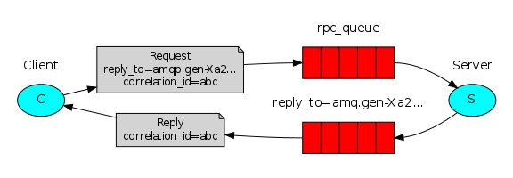

# AMQP Remote procedure call (RPC)

We learned how to use Work Queues to distribute time-consuming tasks among multiple workers.
But what if we need to run a function on a remote computer and wait for the result?
This pattern is commonly known as `Remote Procedure Call` or RPC.

### Callback queue
In general doing RPC over RabbitMQ is easy. A client sends a request message and a server replies with a response message.
In order to receive a response we need to send a 'callback' queue address with the request. We can use the default exchange.

Our RPC will work like this:

- When the Client starts up, it creates an anonymous exclusive callback queue.
- For an RPC request, the Client sends a message with two properties:
	- `reply_to`, which is set to the callback queue and
	- `correlation_id`, which is set to a unique value for every request.
- The request is sent to an rpc_queue queue.
- The RPC worker (aka: server) is waiting for requests on that queue.
When a request appears, it does the job and sends a message with the result back to the Client, using the queue from the reply_to field.
- The client waits for data on the callback queue. When a message appears, it checks the correlation_id property.
If it matches the value from the request it returns the response to the application.